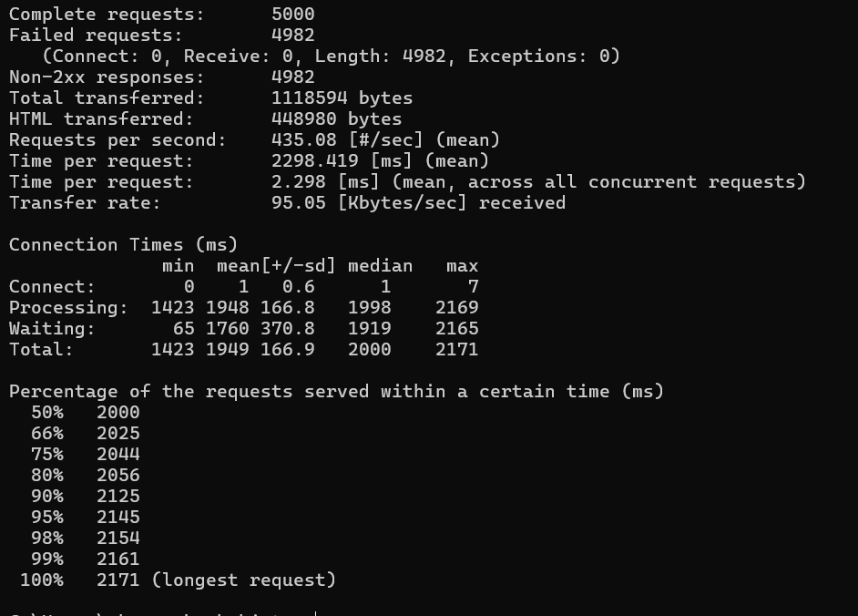

# load_balancer

## Функционал

Сервис используется для балансировки HTTP-запросов между несколькими бэкендами.  
Балансировка осуществляется по алгоритму **round-robin**.  
При недоступности одного из бэкендов — запросы перенаправляются на доступные.

Для проксирования используется встроенный `httputil.ReverseProxy`.

## Детали

Сервис реализован на Go с использованием стандартных библиотек.  
При старте балансировщик читает список бэкендов из конфигурации (в коде или из внешнего файла — опционально).  
Каждый входящий HTTP-запрос логируется и проксируется на один из работающих бэкендов.

Реализованы:
- Алгоритм `round-robin`
- Обработка ошибок при недоступности бэкенда
- Параллельная обработка запросов
- Логирование входящих запросов и ошибок
- Возвращает структурированные ошибки. Примерно: `{ "code": 429, "message": "Rate limit exceeded" }`
- Добавлен механизм `graceful shutdown`

## Запуск

Для начала необходимо склонировать репозиторий:
```bash
    git clone https://github.com/k1v4/load_balancer.git
```

Для демонстрации уже подготовлен docker-compose.yml, в котором поднимаются два сервера на портах 8081 и 8082.
Для запуска стоит ввести команду:
```dockerfile
docker-compose up --build
```

Для этого конечно нужен сам docker.

Запускается базово на порту 8080. И Распределяется нагрузка на 3 сервера, которые указаны в файле `config.yaml`. Для изменения данных следует менять данный файл и пересобирать docker образы.

## Apache Bench

При проведения тестирования с помощью `Apache Bench (ab -n 5000 -c 1000 http://localhost:8080/)` получились следующие результаты:



При тестировании были выставлены маленькие значение токенов, так что получилось слишком много запросов не 200.


